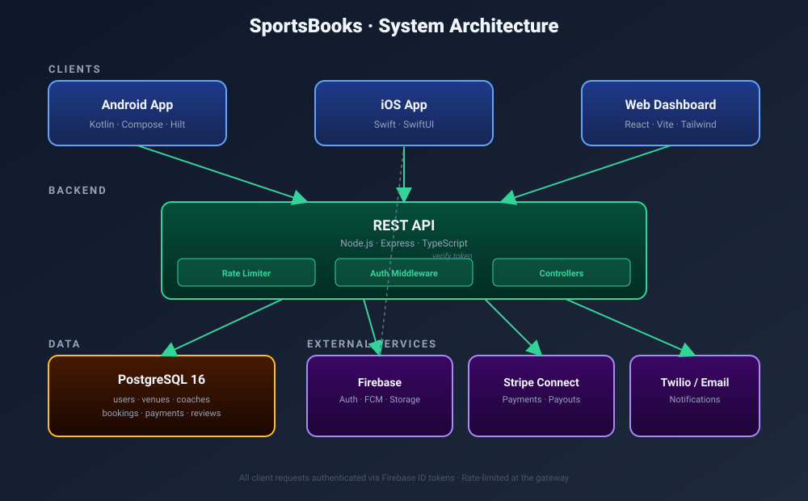
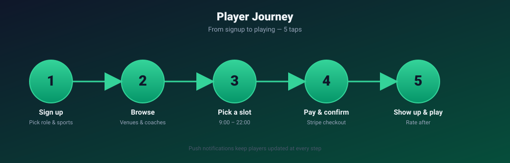
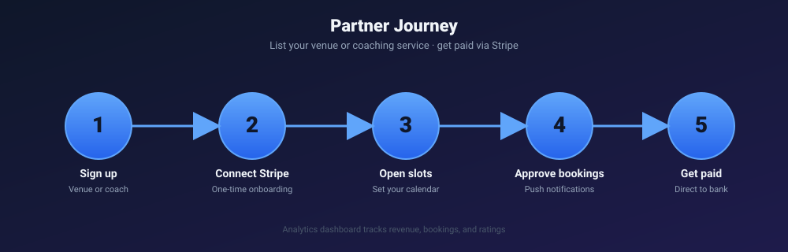
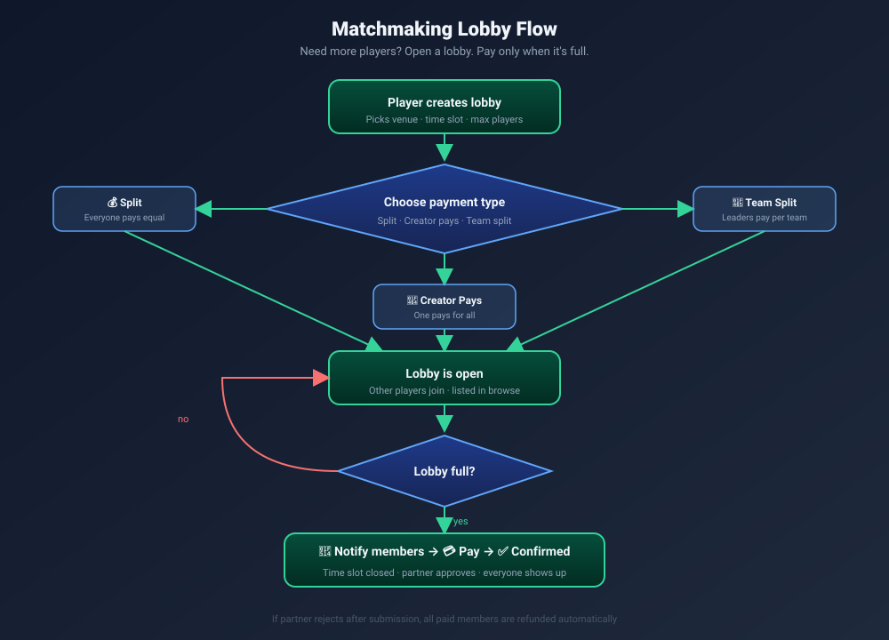

<div align="center">

# 🏟️ SportsBooks

**Find courts. Book coaches. Play together.**

The all-in-one platform for booking sports venues and finding people to play with.

[]()
[]()
[]()

</div>

---

## What is SportsBooks?

SportsBooks is a cross-platform sports booking app. **Players** browse sports, find venues or coaches, and book hourly time slots between 9:00 and 22:00. **Partners** (venue owners and coaches) list their services, manage their calendar, and get paid via Stripe Connect.

It also handles the part nobody else does well: **finding people to play with**. Open a matchmaking lobby, let strangers or friends join, and split the cost automatically when it fills up.

---

## Architecture



- **Mobile** — Kotlin/Compose (Android), Swift/SwiftUI (iOS)
- **Web** — React 18 + Vite + TailwindCSS (admin & partner dashboard)
- **Backend** — Node.js + Express + TypeScript REST API
- **Database** — PostgreSQL 16
- **Auth** — Firebase Auth (token validation only; all business data in PostgreSQL)
- **Payments** — Stripe Connect (direct payouts to partners)
- **Push** — Firebase Cloud Messaging

> Diagrams in this README are SVG. For interactive Mermaid versions (sequence diagrams, ER diagram, mindmaps), see [`docs/diagrams.md`](docs/diagrams.md).

---

## Player Journey



1. **Sign up** — pick "Player", choose your sports and skill level
2. **Browse** — venues and coaches by sport, location, price, and availability
3. **Pick a slot** — see real-time availability, 9:00 – 22:00
4. **Pay & confirm** — Stripe checkout, partner approves, you're booked
5. **Show up & play** — push reminders, in-app chat, rate the venue after

---

## Partner Journey



1. **Sign up** as a venue owner or coach
2. **Connect Stripe** — one-time onboarding for payouts
3. **Open time slots** — set which hours are bookable
4. **Approve bookings** — push notifications for every new request
5. **Get paid** — direct payouts to your bank, with analytics dashboard

---

## Matchmaking Lobbies

Don't have enough players? Create a lobby and let others join.



Three payment models:

| Mode | Who pays | Best for |
|---|---|---|
| **💰 Split** | Everyone equal share | Casual pickup matches |
| **👤 Creator pays** | One person covers it | Birthdays, treats, corporate |
| **👥 Team split** | Each team leader pays for their squad | Team sports (5v5, 7v7) |

Members get push-notified the moment the lobby is full and it's their turn to pay. If the partner rejects the booking, refunds are issued automatically.

---

## Features

### For players
- 🏀 Browse by sport: tennis, football, basketball, padel, volleyball, and more
- 📍 Map view with nearby venues and coaches
- 📅 Real-time time slot availability
- 💳 Secure Stripe payments
- 👥 Friends, parties, and communities
- 💬 In-app chat for bookings, lobbies, and communities
- 📰 News feed with friend activity, top deals, and new venues
- 🏆 XP, achievements, and skill-based matchmaking
- 🔔 Push notifications for every step

### For partners
- 🏟️ Venue & coach profiles with photos and pricing
- 📆 Calendar management
- ✅ Booking approval workflow
- 💰 Stripe Connect direct payouts
- 📊 Analytics: revenue, bookings, ratings
- 🎁 Discount campaigns ("Top Deals")
- ⭐ Review management

---

## Tech Stack

| Layer | Technology | Location |
|---|---|---|
| Web Frontend | React 18, TypeScript, Vite, TailwindCSS | `src/frontend/` |
| Backend API | Node.js, Express, TypeScript | `src/backend/` |
| Android | Kotlin, Jetpack Compose, Hilt, Retrofit | `app/` |
| iOS | Swift, SwiftUI, URLSession | `src/ios/` |
| Database | PostgreSQL 16 | `database/` |
| Shared Contracts | TypeScript interfaces | `src/shared/` |
| Auth | Firebase Auth | All platforms |
| Storage | Firebase Storage | All platforms |
| Payments | Stripe Connect | Backend + Mobile |

---

## Getting Started

### Backend

```bash
cd src/backend
cp .env.example .env       # fill in DATABASE_URL, FIREBASE_*, STRIPE_*
npm install
npm run migrate
npm run dev
```

The API runs on `http://localhost:3000`. Health check at `/health`.

### Web frontend

```bash
cd src/frontend
cp .env.example .env.local # fill in VITE_FIREBASE_*
npm install
npm run dev
```

The web dashboard runs on `http://localhost:5173`.

### Android

```bash
./gradlew :app:assembleDebug
# Install on a connected device or emulator
adb install app/build/outputs/apk/debug/app-debug.apk
```

> Place `google-services.json` in `app/` (gitignored).

### iOS

```bash
cd src/ios
open SportsBooks.xcodeproj
# Build & run from Xcode
```

> Place `GoogleService-Info.plist` in the iOS app bundle (gitignored).

---

## Project Structure

```
SportsBooks/
├── app/                 # Android (Kotlin/Compose) — Gradle module
├── src/
│   ├── backend/         # Node.js + Express + TypeScript REST API
│   ├── frontend/        # React + Vite admin/partner dashboard
│   ├── ios/             # Swift/SwiftUI iOS app
│   └── shared/          # Shared TypeScript contracts (DTOs, enums)
├── database/
│   ├── schemas/         # SQL schema definitions
│   ├── migrations/      # Versioned migrations (NNNN_*.sql)
│   └── queries/         # Reusable SQL queries
├── postman/             # Postman collections for API testing
└── docs/
    ├── diagrams.md      # All diagrams (Mermaid)
    ├── images/          # SVG diagrams
    └── slideshow.html   # Pitch slideshow (open in browser)
```

---

## Security

- 🔐 All secrets are loaded from environment variables — no hardcoded keys
- 🚦 Rate limiting: **5 requests / 15 min** on auth routes, **100 requests / 15 min** on the API
- 🔑 Firebase Auth tokens validated on every request via auth middleware
- 💸 Stripe webhooks verified with signing secret
- 🗄️ All foreign keys use explicit `ON DELETE` / `ON UPDATE` rules
- 🚫 `.env*`, `google-services.json`, `GoogleService-Info.plist`, and service-account JSONs are gitignored

---

## Documentation

- 📐 [`docs/diagrams.md`](docs/diagrams.md) — Mermaid diagrams (architecture, flows, ER, sequence)
- 🎬 [`docs/slideshow.html`](docs/slideshow.html) — Pitch slideshow (open in any browser)
- 📬 [`postman/`](postman/) — Postman collections for end-to-end API testing

---

<div align="center">

**SportsBooks** · Find your court. Find your people. Just play.

</div>
