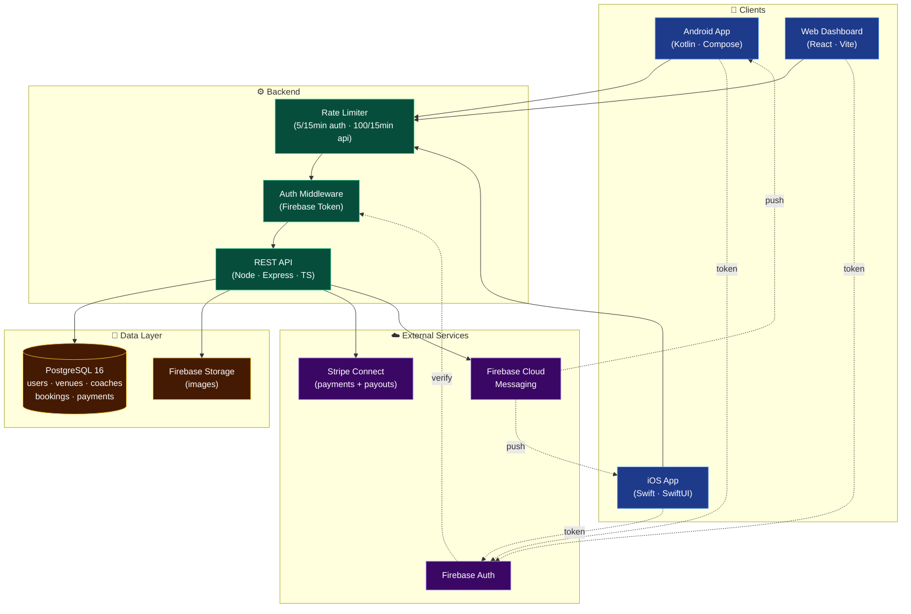
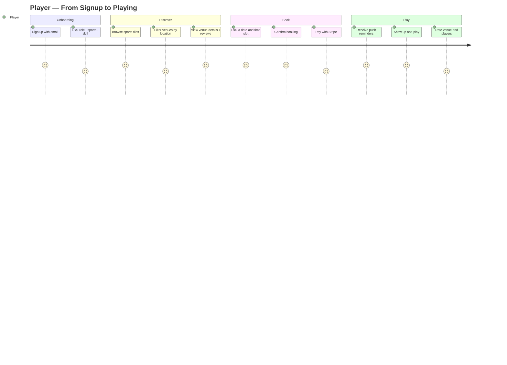
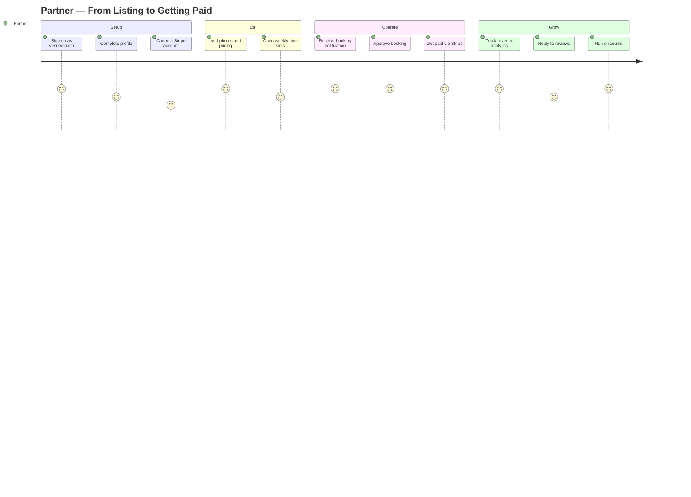
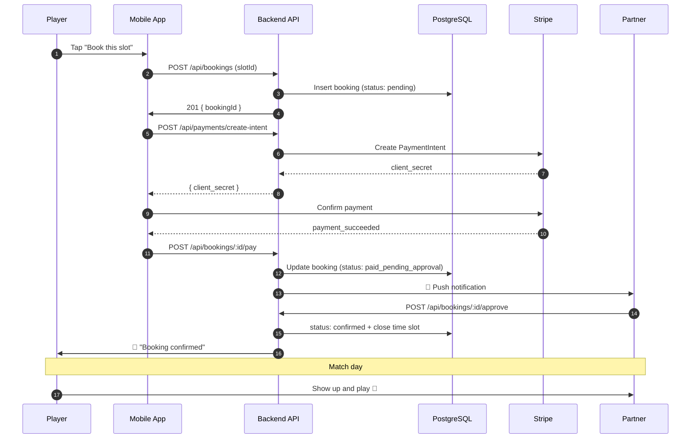
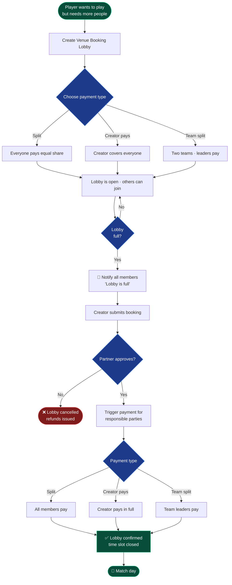
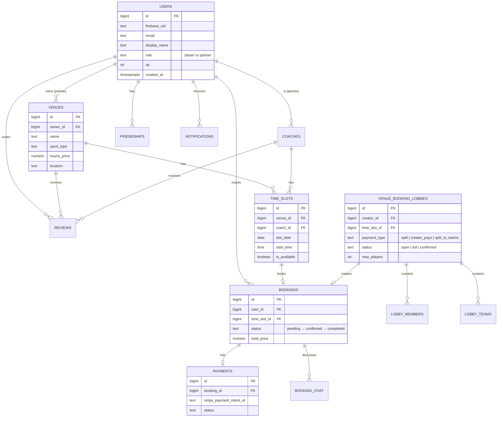
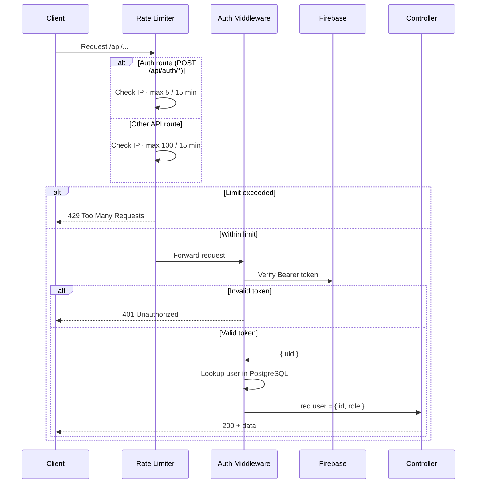
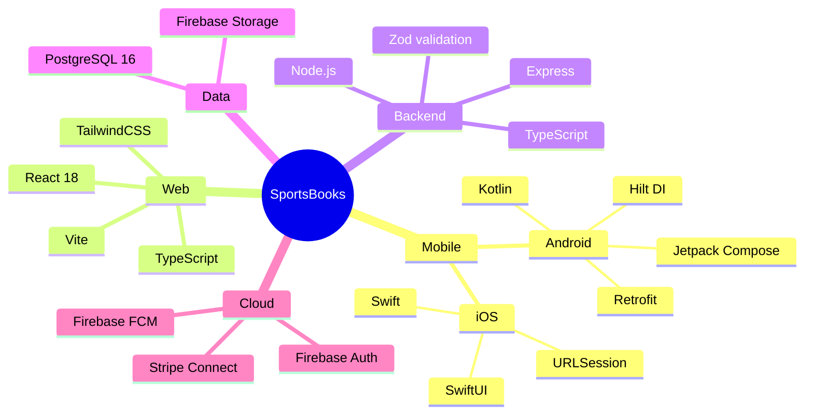

# SportsBooks — Visual Overview

All diagrams below are written in [Mermaid](https://mermaid.js.org/) and render automatically on GitHub. No images, no Figma — just commit the markdown.

---

## 1. System Architecture

---

## 2. Player Journey

---

## 3. Partner Journey

---

## 4. Booking Flow (Sequence)

---

## 5. Matchmaking Lobby Flow

---

## 6. Domain Model (ER Diagram)

---

## 7. Auth & Rate Limiting

---

## 8. Tech Stack at a Glance

